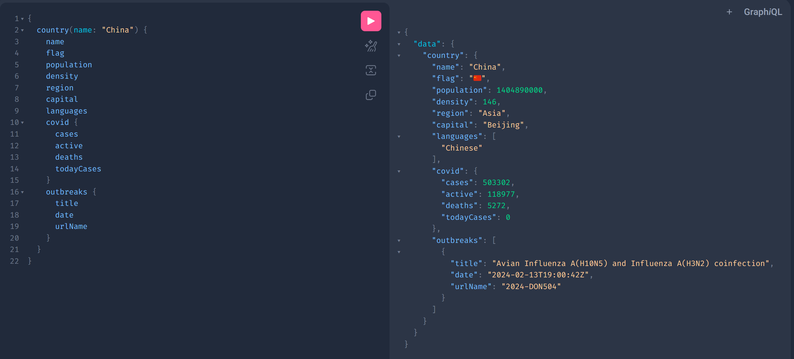

# 🌐 GeoQuery — GraphQL API for Country Intelligence

> A GraphQL API built with Go that serves country demographics, COVID-19 statistics, and WHO disease outbreak alerts — the same data powering the [GeoVitals Chrome Extension](https://github.com/Him97kr/chrome-extension-geovitals).

[](https://golang.org)
[](https://graphql.org)
[](LICENSE)

---

## ✨ Features

- **GraphQL API** — flexible queries, get exactly the data you need
- **Country demographics** — population, density, area, region, languages, currencies
- **COVID-19 statistics** — cases, deaths, active, critical, per-million rates
- **WHO outbreak alerts** — live disease outbreak news filtered by country
- **Global stats** — most populated, highest density, most COVID cases
- **Smart filtering** — filter countries by region, population range
- **30-minute cache** — fast repeated queries without hammering APIs
- **GraphiQL playground** — interactive API explorer built in

---

## 🚀 Quick Start

### Prerequisites
- Go 1.22+

### Run Locally

```bash
# Clone the repo
git clone https://github.com/Him97kr/geoquery.git
cd geoquery

# Download dependencies
go mod tidy

# Start the server
make run
```

Open your browser at `http://localhost:8080/playground`

---

## 📊 GraphiQL Playground

The playground is available at `/playground` — use it to explore and test all queries interactively.



---

## 🔌 API Endpoints

| Endpoint | Method | Description |
|---|---|---|
| `/graphql` | POST | GraphQL query endpoint |
| `/playground` | GET | GraphiQL browser IDE |
| `/health` | GET | Health check |

---

## 📝 Example Queries

### Single Country
```graphql
{
  country(name: "India") {
    name
    flag
    population
    density
    region
    capital
    languages
    covid {
      cases
      active
      deaths
      todayCases
    }
    outbreaks {
      title
      date
      url
    }
  }
}
```

### Filter Countries by Region
```graphql
{
  countries(region: "Asia", minPop: 10000000, limit: 10) {
    name
    flag
    population
    density
  }
}
```

### Search Countries
```graphql
{
  searchCountries(query: "stan") {
    name
    code
    region
    population
  }
}
```

### Global Stats
```graphql
{
  globalStats {
    totalCountries
    totalPopulation
    totalCovidCases
    totalCovidDeaths
    mostPopulated {
      name
      population
      flag
    }
    highestDensity {
      name
      density
      flag
    }
    mostCovidCases {
      name
      flag
      covid {
        cases
        deaths
      }
    }
  }
}
```

### Top 10 by Population
```graphql
{
  topByPopulation(limit: 10) {
    name
    flag
    population
    region
  }
}
```

### Top 10 by COVID Cases
```graphql
{
  topByCovid(limit: 10) {
    name
    flag
    covid {
      cases
      deaths
      active
    }
  }
}
```

### Countries With Active WHO Alerts
```graphql
{
  countriesWithOutbreaks {
    name
    flag
    outbreaks {
      title
      date
      url
    }
  }
}
```

---

## 🌐 Data Sources

All APIs are **free** and require **no API key**.

| API | Data | URL |
|---|---|---|
| REST Countries v4 | Demographics | `restcountries.com` |
| disease.sh | COVID-19 stats | `disease.sh` |
| WHO Outbreak News | Disease alerts | `who.int` |

---

## 📁 Project Structure

```
geoquery/
├── graph/
│   ├── schema.graphqls        ← GraphQL schema definition
│   └── resolver/
│       └── resolver.go        ← Query resolvers
├── internal/
│   └── fetcher/
│       └── fetcher.go         ← API fetching + 30-min cache
├── server/
│   └── main.go                ← HTTP server + GraphQL schema
├── go.mod
├── Makefile
└── Dockerfile
```

---

## 🛠️ Available Commands

```bash
make run      # Start dev server on :8080
make build    # Compile production binary to bin/geoquery
make tidy     # Download and tidy Go modules
make clean    # Remove compiled binary
```

---

## 🐳 Docker

```bash
# Build image
docker build -t geoquery .

# Run container
docker run -p 8080:8080 geoquery
```

---

## 🔗 Related Projects

| Project | Description |
|---|---|
| [GeoVitals](https://github.com/Him97kr/chrome-extension-geovitals) | Chrome extension that uses this data |
| [World Population Dashboard](https://github.com/Him97kr/world-population-dashboard) | D3.js data visualisation |

---

## 🤝 Contributing

1. Fork the repository
2. Create a feature branch: `git checkout -b feature/my-feature`
3. Commit: `git commit -m "add my feature"`
4. Push: `git push origin feature/my-feature`
5. Open a Pull Request

---

## 📄 License

MIT License — see [LICENSE](LICENSE) for details.
